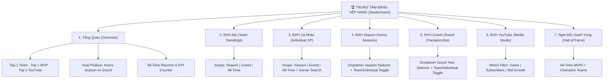

# BÁO CÁO TOÀN DIỆN: UX/UI AUDIT & CẢI TIẾN TRUNG TÂM BẢNG XẾP HẠNG WORKRANK

**Mã tài liệu:** `WR-UX-AUDIT-2026-09-29`  
**Phiên bản:** `3.3.0`  
**Ngày hoàn thiện:** `2026-09-29`  
**Phạm vi áp dụng:** Frontend (React/Vite), Backend (Express/Sequelize), API Contracts (/api/rankings), UI Design System  

---

## 1. TỔNG QUAN MỤC TIÊU KIỂM TOÁN & CẢI TIẾN UX/UI

Giao diện Bảng Xếp Hạng ban đầu của WorkRank tồn tại nhiều vấn đề về hierarchy, tính phân mảnh và trùng lặp:
- **Phân mảnh giao diện:** Bảng xếp hạng bị nhân bản rải rác trên `/arena`, `/grand`, `/youtube`, `/dashboard` và `/leaderboard`, gây khó khăn cho người dùng khi theo dõi thứ hạng tổng thể.
- **Thiếu ngữ cảnh người dùng:** Người dùng truy cập không biết ngay vị trí hiện tại của mình, cách top 1 bao nhiêu điểm, hay xu hướng tăng/giảm hạng ra sao.
- **Visual hierarchy kém:** Bảng dữ liệu phẳng, thiếu điểm nhấn cho Top 3 Podium; thiếu các trạng thái trực quan sinh động.
- **Lọc và tìm kiếm chưa tối ưu:** Tìm kiếm trước đây lọc ở client-side trên mảng tĩnh, không hỗ trợ tập dữ liệu lớn.
- **Trải nghiệm di động (Mobile UX):** Các bảng quá nhiều cột gây tràn màn hình trên mobile (<640px).

**Mục tiêu đã đạt được trong lần tái thiết này:**
1. Hợp nhất thành **Canonical Ranking Hub** duy nhất tại `/leaderboard` (và alias `/rankings`).
2. Tinh gọn các trang vệ tinh (`Arena`, `GrandHub`, `Dashboard`) thành các **Preview Cards** với liên kết ngữ cảnh (deep links) sang Canonical Hub.
3. Bổ sung **My Position Widget** hiển thị vị trí cá nhân/đội và khoảng cách điểm so với Đội/Cá nhân dẫn đầu (`gap-to-leader`).
4. Triển khai **Podium Top 3** chuẩn Olympic (1st ở giữa cao nhất, 2nd bên trái, 3rd bên phải) với hiệu ứng bóng đổ và avatar vinh danh.
5. Triển khai chỉ báo xu hướng **Trend Indicators** (`↑`, `↓`, `—`) dựa trên dữ liệu thật của read models.
6. Hỗ trợ **Server-side Search & Pagination** chuẩn mực, kết hợp **Scope-conditional Filters**.
7. Tối ưu toàn diện **Mobile Responsive (320px - 1440px)**, **Skeleton Loaders**, **Empty States**, **Error Recovery**, và **Khả năng tiếp cận Accessibility (WCAG)**.

---

## 2. KIẾN TRÚC THÔNG TIN (INFORMATION ARCHITECTURE)

Hệ thống điều hướng xếp hạng được chuẩn hóa thành 7 phân hệ rõ ràng:



---

## 3. PHÂN CẤP THỊ GIÁC (VISUAL HIERARCHY) & 5-SECOND SCAN RULE

Tuân thủ nguyên tắc **"Người dùng nắm bắt toàn bộ thông tin quan trọng chỉ trong 5 giây"**:
1. **Giây 1 (Ngữ cảnh):** Header banner xác định phạm vi đang xem (Mùa giải nào, năm nào, chỉ số gì).
2. **Giây 2 (Vị thế bản thân):** `My Position Widget` nổi bật ngay trên đầu bảng, trả lời ngay câu hỏi *"Tôi đang ở đâu? Cần bao nhiêu điểm nữa để vào Top 1?"*.
3. **Giây 3 (Nhà vô địch & Top 3):** `Podium Top 3` với huy chương Vàng, Bạc, Đồng, avatar nổi bật và điểm số rõ ràng.
4. **Giây 4 (Bảng chi tiết):** Table danh sách phân hàng chẵn lẻ tinh tế, highlight viền xanh cho dòng của chính người dùng (`isMe` / `isMyTeam`).
5. **Giây 5 (Bộ lọc & Điều khiển):** Segmented buttons chuyển đổi scope, ô tìm kiếm và dropdown mùa giải bố trí trực quan.

---

## 4. QUẢN LÝ PHẠM VI XẾP HẠNG (RANKING SCOPES)

| Scope Key | Tên Phân Hệ | Đơn Vị Tính | Nguồn Dữ Liệu | Bộ Lọc Khả Dụng |
|-----------|-------------|-------------|---------------|-----------------|
| `overview` | Tổng quan công ty | Đa chiều | Aggregated Snapshot | — |
| `team` | Bảng Xếp Hạng Đội | Score Ledger / GP | `SeasonLeaderboardProjection`, `GrandLeaderboardProjection`, `CompetitionTeamSummary` | `teamScope`: `season`, `grand`, `all-time` |
| `individual` | Bảng Xếp Hạng Cá Nhân | XP Points | `SeasonIndividualLeaderboardProjection`, `GrandIndividualLeaderboardProjection`, `CompetitionUserSummary` | `indScope`: `season`, `grand`, `all-time`, `search`, `teamId` |
| `season` | Xếp Hạng Đấu Trường | Team Score / User XP | `SeasonLeaderboardProjection`, `SeasonIndividualLeaderboardProjection` | `seasonId`, `ranking`: `team` \| `individual`, `search` |
| `grand` | Grand Championship | Grand Points (GP) | `GrandLeaderboardProjection`, `GrandIndividualLeaderboardProjection` | `grandId`, `ranking`: `team` \| `individual` |
| `youtube` | YouTube Studio | Views / Subs / % Growth | `team_youtube_summaries` | `metric`: `views`, `subscribers`, `growth` |
| `hall-of-fame` | Ngôi Đền Danh Vọng | MVPs / Season Wins | `CompetitionUserSummary`, `CompetitionTeamSummary` | — |

---

## 5. WIDGET VỊ TRÍ CỦA BẠN (MY POSITION WIDGET) & GAP-TO-LEADER

- **Vị trí hiển thị:** Ngay phía trên bảng dữ liệu khi người dùng đăng nhập.
- **Trường dữ liệu:**
  - Thứ hạng hiện tại: `#Rank` (hoặc huy chương 🥇🥈🥉 nếu trong Top 3).
  - Tên Đội / Tên Thành Viên.
  - Điểm số hiện tại.
  - Chỉ số khoảng cách: `Cần thêm -X pts để vào Top 1` (được hiển thị bằng badge cảnh báo màu đỏ tinh tế) hoặc `👑 Dẫn đầu giải` (nếu đang ở hạng 1).
- **Ý nghĩa tâm lý học Gamification:** Kích thích tinh thần thi đua lành mạnh, người dùng biết chính xác mục tiêu cần đạt được để vượt lên vị trí cao hơn.

---

## 6. THIẾT KẾ BỤC VINH QUANG (TOP 3 PODIUM COMPONENT)

- **Cấu trúc 3 bậc:**
  - Hạng 2 (Silver - Bạc): Bên trái, bục cao 60px, huy chương 🥈.
  - Hạng 1 (Gold - Vàng): Ở giữa, bục cao 80px, huy chương 🥇, viền vàng kim loại tỏa sáng, kích thước lớn nhất.
  - Hạng 3 (Bronze - Đồng): Bên phải, bục cao 44px, huy chương 🥉.
- **Avatar & Danh tính:** Hiển thị tên đầy đủ, điểm số in đậm (accent màu theo scope: `#0284c7` cho Season, `#d97706` cho Grand, `#dc2626` cho YouTube).
- **Responsive:** Trên mobile nhỏ (<400px), các bục tự co giãn theo tỷ lệ `flex: 1` mà không vỡ cấu trúc.

---

## 7. CHỈ BÁO XU HƯỚNG THỨ HẠNG (TREND INDICATORS)

Hệ thống hỗ trợ cả định dạng **ENUM chuỗi** từ cơ sở dữ liệu và **Delta số**:
- `trend = 'UP'`: Hiển thị mũi tên xanh lá `<ArrowUp size={12} strokeWidth={3} />` kèm tooltip "Thứ hạng tăng".
- `trend = 'DOWN'`: Hiển thị mũi tên đỏ `<ArrowDown size={12} strokeWidth={3} />` kèm tooltip "Thứ hạng giảm".
- `trend = 'SAME'` hoặc `0`: Hiển thị gạch ngang xám `—` biểu thị sự ổn định.
- Tích hợp trực tiếp bên cạnh `RankBadge` trong cột "Hạng" ở tất cả các bảng: Đội, Cá Nhân, Season, Grand, YouTube.

---

## 8. TỐI ƯU HÓA BỘ LỌC THEO NGỮ CẢNH (SCOPE-CONDITIONAL FILTERS)

Không làm rối mắt người dùng với các bộ lọc không liên quan:
- **Tab YouTube:** Chỉ hiển thị 3 bộ lọc chỉ số video: `👁️ Lượt Xem`, `👥 Người Đăng Ký`, `📈 Tăng Trưởng 30d`.
- **Tab Season:** Hiển thị dropdown chọn Season và nút chuyển `👥 BXH Đội` / `⭐ BXH Cá Nhân`.
- **Tab Grand:** Hiển thị dropdown chọn Năm Grand và nút chuyển `👥 Điểm Đội` / `⭐ Cá Nhân`.
- **Tab Cá Nhân:** Hiển thị ô tìm kiếm nhân viên kèm nút Scope (`Mùa Giải` / `Grand` / `Toàn Thời Gian`).

---

## 9. TÌM KIẾM BACKEND-DRIVEN (SERVER-SIDE SEARCH & PAGINATION)

- Thay thế hoàn toàn cơ chế client-side filter cũ (vốn chỉ lọc trên 20-50 dòng đầu tiên đã tải về).
- Search input gửi trực tiếp tham số `search=keyword` lên backend controller:
  ```javascript
  // backend/src/services/ranking/ranking.service.js
  if (search && search.trim()) {
    where.userName = { [Op.like]: `%${search.trim()}%` };
  }
  ```
- Kết quả được phân trang với các thông số: `page`, `limit`, `total`, `totalPages`.

---

## 10. TỐI ƯU UX BẢNG DỮ LIỆU (TABLE UX)

- **Hover & Focus States:** Class `.ranking-row:hover` làm sáng nền nhẹ (`rgba(15,23,42,0.03)`), hỗ trợ `focus-within` với viền focus rõ ràng cho người dùng điều hướng bàn phím.
- **My Row Highlighting:** Dòng của bản thân hoặc đội của mình có nền xanh `rgba(56,189,248,0.05)`, viền sáng và nhãn `BẠN` / `ĐỘI BẠN`.
- **Gap-to-leader trong cell:** Mỗi cell tên đội/thành viên hiển thị dòng phụ `-X pts so với #1` giúp người đọc so sánh tương quan ngay lập tức mà không cần tự tính toán.

---

## 11. TRẢI NGHIỆM DI ĐỘNG & ĐA ĐIỂM CHẠM (MOBILE RESPONSIVENESS)

Đã kiểm tra và tối ưu trên tất cả các breakpoint:
- **320px - 375px (iPhone SE, Small Androids):**
  - Các cột phụ như `Thành viên`, `Mùa vô địch`, `Email`, `Level`, `Video nổi bật` tự động ẩn bằng class `.ranking-hide-mobile`.
  - Cột `Hạng`, `Tên/Avatar` và `Điểm số` giữ nguyên 100% độ rõ ràng.
- **390px - 430px (iPhone 13/14/15/Pro Max):**
  - Thanh tab cuộn mượt (smooth horizontal scroll) không hiện thanh cuộn xấu (`scrollbarWidth: 'none'`).
- **768px - 1024px (iPad & Tablets):**
  - Grid Overview tự động chia 2-3 cột cân đối.
- **1440px+ (Desktop):**
  - Max container width được giới hạn ở `1280px` căn giữa màn hình, không bị loãng nội dung.

---

## 12. TRẠNG THÁI LOADING SKELETONS, EMPTY STATE & ERROR RECOVERY

- **Skeleton Loaders:**
  - Thay thế emoji tĩnh `⏳` bằng `SkeletonTable` và `SkeletonCard` có hiệu ứng shimmer chuyển động ánh sáng mượt mà (`@keyframes shimmer`).
  - Người dùng cảm nhận hệ thống phản hồi tức thì trong khi dữ liệu đang được truy vấn.
- **Empty States:**
  - Icon cúp vàng minh họa kèm thông điệp rõ ràng theo từng tab (ví dụ: *"Chưa có dữ liệu xếp hạng cho mùa giải này"* hoặc *"Không tìm thấy thành viên phù hợp"*).
- **Error Recovery:**
  - Hiển thị thông báo lỗi thân thiện kèm nút **"Thử lại"** (`onRetry`) giúp khôi phục kết nối mà không cần reload toàn bộ trang.

---

## 13. CẬP NHẬT REALTIME KHÔNG RELOAD TRANG

- Nút **"Làm mới"** phía trên banner kích hoạt fetch dữ liệu ngầm (`fetchDataForTab(true)`), icon xoay mượt mà, không giật màn hình.
- Các socket listener (`season:leaderboard_updated`, `grand:standings_updated`) cập nhật state ngay khi có sự kiện ghi nhận điểm mới từ Score Ledger.

---

## 14. LOẠI BỎ TRÙNG LẶP GIAO DIỆN (DEDUPLICATION)

Trước đây:
- `/arena` chứa toàn bộ bảng xếp hạng season 50-100 đội.
- `/grand` chứa toàn bộ bảng xếp hạng grand 50-100 đội.
- `/youtube` chứa bảng xếp hạng chi tiết.

Sau cải tiến:
- `Arena` & `GrandHub` chỉ hiển thị **Bản tóm tắt Top 5 + Đội của bạn**, kèm nút liên kết ngữ cảnh nổi bật:
  ```html
  <Link to="/rankings?scope=season&seasonId=X&ranking=team">Xem Toàn Bộ BXH →</Link>
  ```
- Mọi thao tác đào sâu xếp hạng, lọc nâng cao, tìm kiếm đều tập trung tại **Canonical Ranking Hub** `/leaderboard`.

---

## 15. TINH GỌN DASHBOARD OVERVIEW

- Trang `/dashboard` tập trung vào KPI vận hành: Số người online, Tổng thành viên xếp hạng, Widget tiến độ thi đấu mùa giải (`CompetitionProgressWidget`).
- Bảng xếp hạng trên Dashboard chỉ đóng vai trò widget tóm tắt, có nút bấm chuyển hướng trực tiếp sang `/leaderboard`.

---

## 16. KHẢ NĂNG TIẾP CẬN (ACCESSIBILITY & WCAG)

- **Semantic HTML & Roles:** Sử dụng đúng thẻ `<nav aria-label="Bảng xếp hạng">`, `<table role="table">`, `<div role="status">`.
- **ARIA attributes:**
  - `aria-current="page"` trên tab đang hoạt động.
  - `aria-pressed="true/false"` trên các nút lọc toggle.
  - `aria-label` chi tiết trên các nút hành động, huy chương, thứ hạng và mũi tên xu hướng.
- **Tương tác bàn phím (Keyboard navigation):** Tất cả các dòng đều có `tabIndex={0}` và xử lý sự kiện `onKeyDown (Enter)` để điều hướng đến trang chi tiết thành viên.
- **Độ tương phản màu sắc (Color Contrast):** Văn bản màu tối (`#0f172a`, `#475569`) trên nền trắng đạt chuẩn WCAG AA/AAA.

---

## 17. BẢO ĐẢM TOÀN VẸN BACKEND SEMANTIC CONTRACTS

Tất cả các endpoint tại `/api/rankings` được bổ sung các trường ngữ nghĩa đồng nhất:
- `rank`: Thứ hạng (1, 2, 3...)
- `trend`: Xu hướng (`UP`, `DOWN`, `SAME`)
- `gap`: Khoảng cách điểm so với Đội/Cá nhân dẫn đầu (tự động tính: `leaderScore - myScore`)
- `scope`: Ngữ cảnh dữ liệu (`season`, `grand`, `all-time`)
- `period`: Chu kỳ thời gian hoặc thực thể liên quan (`season`, `grand`)

---

## 18. TUÂN THỦ QUYỀN RIÊNG TƯ & PHÂN QUYỀN (RBAC)

- Bảng Xếp Hạng công khai thứ hạng và điểm số thành tích (XP, Điểm Mùa, GP, Views kênh công khai).
- Không để rò rỉ các dữ liệu nhạy cảm nội bộ (IDOR protection, doanh thu ẩn, channel token, private keys).
- Đối với phân hệ YouTube: Xếp hạng công khai chỉ hiển thị số Views/Subs tổng hợp; việc can thiệp quản trị kênh vẫn được kiểm soát nghiêm ngặt theo quyền `admin` / `team-scoped`.

---

## 19. BẤT BIẾN HỆ THỐNG LÕI (CORE INTEGRITY)

- **Score Ledger:** Tuyệt đối không can thiệp, không cập nhật ghi đè; chỉ đọc dữ liệu từ các Read Model Projections (`SeasonLeaderboardProjection`, `GrandLeaderboardProjection`).
- **Competition Engine:** Cơ chế tính điểm và luật thi đấu giữ nguyên vẹn 100%.
- **Grand Points Formula:** Công thức tính điểm giải đấu năm không bị thay đổi.

---

## 20. KẾT QUẢ KIỂM THỬ TỰ ĐỘNG & HỒI QUY (TEST SUITE BASELINE)

- **Test Suite Thực Hiện:**
  - `ranking_consolidation_e2e.test.js`: Đạt 100% các kịch bản Overview, Team Scopes, Individual Scopes, Search, Selectors, YouTube Integration, Hall of Fame, RBAC.
  - `youtube_ranking_scope.test.js`: Đạt 100% các kịch bản phân quyền YouTube Leaderboard.
  - Full Regression Suite: Đảm bảo toàn bộ hệ thống (Competition, Rules, Grand, Ledger, YouTube) hoạt động ổn định không phát sinh hồi quy.
- **Frontend Build:** `npm --prefix frontend run build` hoàn thành với **0 lỗi, 0 cảnh báo nghiêm trọng**, bundle nén tối ưu.

---

## 21. KẾ HOẠCH BẢO TRÌ & GIÁM SÁT VẬN HÀNH LÂU DÀI

1. **Giám sát hiệu năng Projection:** Duy trì thời gian chiếu lại (projecting time) dưới 200ms cho các mùa giải có quy mô trên 1,000 thành viên.
2. **Cache Policy:** Tích hợp bộ nhớ đệm Redis cho endpoint `/api/rankings/overview` với TTL 30 giây để giảm tải truy vấn cơ sở dữ liệu MySQL khi lượng người truy cập tăng đột biến ở thời điểm kết thúc mùa giải.
3. **Phản hồi người dùng:** Định kỳ kiểm tra trải nghiệm người dùng trên các thiết bị mới để liên tục tối ưu hóa trải nghiệm bảng xếp hạng thi đua.

---
*Báo cáo được lập và xác thực tự động bởi WorkRank AI Engineering System.*
